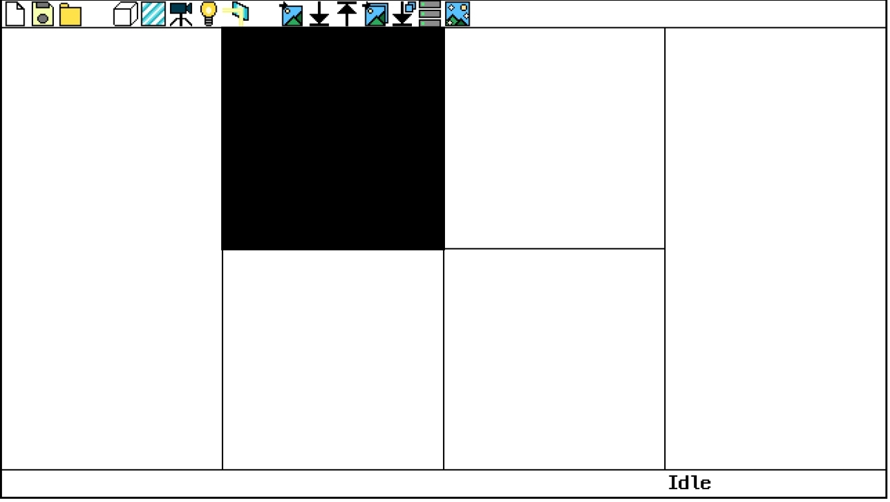
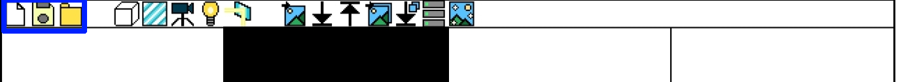
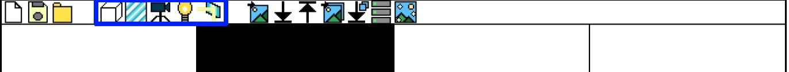
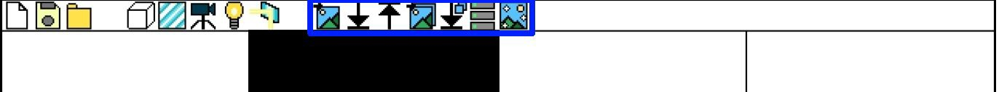

# Reflection Image Synthesis and Reflection Removal Project

## Overview

This is a web app which synthesizes reflected, non-reflected image pair and train/tests image.

## How to Use

### 1. Layout.

There are 8 areas.

The upper bar area is an area which contains function buttons.  
The left bar area shows hierarchy of objects.  
The right bar area shows property of objects.  
The lower bar area shows status of the program.  

There are four main screens.

The upper-left screen shows the 3D space which will be synthesized to images.

The upper-right screen shows the transformed image.

The lower-left screen shows the background image (Reflection-Removed) of test image.

The lower-right screen shows the reflected image.

### 2. Creating, Saving file.

The upper bar area has three buttons (new file, save, load) from the left. New file button makes the new 3D space file. Save file button saves the 3D space data into your computer. Pressing the save button will download a 3D data file. Load file loads the 3D space file and loads 3D data from the file.

### 3. Editing Space.

The upper bar ares has buttons in the middle. From left to right, there is cube, glass, camera, light, and reflection button. The cube button generates the cube in the middle of the screen, glass button generates the glass in the middle of the screen. Camera button goes to camera editing page, light button goes to light editing page. Reflection button toggles reflection. 

### 4. Image Convert & Generation.

### 5. Training & Testing Image.