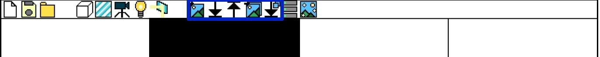

# Reflection Image Synthesis and Reflection Removal Project

## Overview

This is a web app which synthesizes reflected, non-reflected image pair and train/tests image.

## How to Use

### 1. Layout.

There are 8 areas.

The upper bar area is an area which contains function buttons.  
The left bar area shows hierarchy of objects.  
The right bar area shows property of objects.  
The lower bar area shows status of the program.  

There are four main screens.

The upper-left screen shows the 3D space which will be synthesized to images.

The upper-right screen shows the transformed image.

The lower-left screen shows the background image (Reflection-Removed) of test image.

The lower-right screen shows the reflected image.

### 2. Creating, Saving file.

The upper bar area has three buttons (new file, save, load) from the left. New file button makes the new 3D space file. Save file button saves the 3D space data into your computer. Pressing the save button will download a 3D data file. Load file loads the 3D space file and loads 3D data from the file.

### 3. Editing Space.

The upper bar ares has buttons in the middle. From left to right, there is cuboid, glass, camera, light, and reflection button. The cuboid button generates the cuboid in the middle of the screen, glass button generates the glass in the middle of the screen. Camera button goes to camera editing page, light button goes to light editing page. Reflection button toggles reflection.

By pressing cuboid button generates the cuboid. The cuboid is added in to the list which can be viewed in the left bar. From the left bar, objects can be selected by selecting their names. The selected object can be added in the right bar of the program. The object's position, rotation and size can be changed. Textures can be applied in cuboids by uploading an image.

By pressing the camera button, the program can edit camera's position and rotation.

By pressing the light button, the program can edit light's direction.

### 4. Image Convert & Generation.

The right side of the upper bar has buttons. From left to right, there is single image convert, single image download, image upload, multiple image convert, multiple image download buttons.

Pressing single image convert button converts current 3D space into an image. Pressing single image download button downloads the converting image.  

Pressing image upload button uploads test image from computer.  
Pressing multiple image convert button generated multiple image pairs form 3D space. These image pair varies camera angle and position. The image pair contains two images which is reflection and non-reflection pair.

### 5. Training & Testing Image.

The right side of the upper bar has buttons. There are two buttons, 